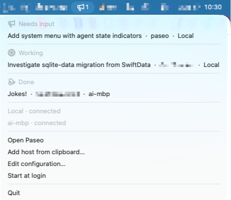
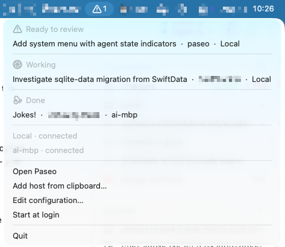
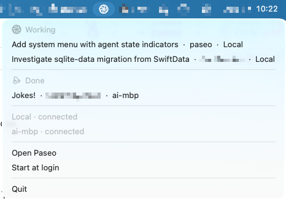

# Paseo Icon

A menu-bar indicator for [Paseo](https://paseo.sh) workspaces on macOS. It shows
which of your workspaces need input, failed, are ready to review, or are still
working, and lets you jump straight to one from the tray — no window, no dock icon.

Licensed under AGPL-3.0-or-later. See [LICENSE](LICENSE).

## What it looks like

The tray icon is whichever bucket is most urgent across every host you watch,
badged with how many workspaces are in it. The menu groups the workspaces the
same way the Paseo sidebar does — **Needs input**, **Failed**, **Ready to
review**, **Working**, **Done** — and clicking a row opens it in Paseo.

<table>
<tr>
<td align="center" width="33%"><b>Needs input</b><br>an agent is waiting on you</td>
<td align="center" width="33%"><b>Ready to review</b><br>an agent finished, unreviewed</td>
<td align="center" width="33%"><b>Working</b><br>nothing needs you, so no count</td>
</tr>
<tr>
<td valign="top"><a href="docs/screenshots/needs-input.png"></a></td>
<td valign="top"><a href="docs/screenshots/ready-to-review.png"></a></td>
<td valign="top"><a href="docs/screenshots/working.png"></a></td>
</tr>
</table>

Only **Needs input**, **Failed**, and **Ready to review** are counted, so the
badge disappears once the remaining work is just running or done. Click any
screenshot for a full-size copy.

Below the workspaces, each host reports whether it is connected, so a daemon
that has gone away is visible rather than silently missing.

## Install

```bash
brew install --cask gpambrozio/tap/paseo-menubar
```

Or download the dmg from [the latest release](https://github.com/gpambrozio/paseo-menubar/releases/latest).

Builds are Apple Silicon only and need macOS 13 or later. The app and the disk image
are both signed and notarized, so Gatekeeper opens it without a right-click detour.

To remove it, `brew uninstall --cask paseo-menubar` — or `--zap` instead of
`--cask` to take its own preferences with it. Paseo Icon stores no host
credentials of its own.

## Requirements

Paseo Icon needs the [Paseo desktop app](https://paseo.sh) installed and at
least one host paired in it. It does not run agents itself — it is a status
indicator and launcher for daemons the desktop app already knows about.

## Hosts

There is nothing to configure. Paseo Icon reads the host list straight out of
the Paseo desktop app's own storage, so it shows exactly the hosts the app's
sidebar shows, with the credentials the app already holds. Pair a host in the
Paseo app and it appears in the menu bar within a moment; remove it there and
it goes away.

If the tray shows **No hosts yet**, the desktop app has no hosts paired. If it
shows a configuration error naming the Paseo app, the app is not installed or
its storage could not be read; the row opens the app, which is where every
one of those is fixed.

## Development

```bash
npm install
npm run start      # generate icons, build, and launch
npm run typecheck
npm test
npm run dist        # package a local build (unnotarized)
```

The tray icons in `assets/generated/` are generated by `npm run icons`, not
committed, and both `start` and `dist` run it. Launching `electron .` by hand
after only `npm run build` gives you a status item with no visible image.

On macOS with Homebrew's `libvips` installed, `npm install` needs
`SHARP_IGNORE_GLOBAL_LIBVIPS=1` set, or `sharp` tries to build against the
Homebrew copy and fails:

```bash
SHARP_IGNORE_GLOBAL_LIBVIPS=1 npm install
```

## Platform support

macOS only. Windows and Linux are not built yet.

## Design

`docs/superpowers/` holds the design document this app was built from, and the
implementation plan that followed it. The design document is the one that
binds; the plan is kept as a record and has known defects. [CLAUDE.md](CLAUDE.md)
covers the conventions.
